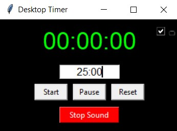

# Timer App


A simple timer application built with Python and Tkinter that plays custom sounds at specific intervals and lets you overlay on top of apps.

## Features

- Visual countdown timer
- Custom sound notifications:
  - Sound at half-time
  - Sound when timer ends
- Minimalistic
- Lets you Overlay on other screens

## How to Use

1. Run the application (timer_app.exe)
2. Enter the desired time in minutes
3. Click "Start" to begin the countdown
4. The app will play sounds at:
   - Half of the specified time
   - When the timer ends
5. checkbox on the top right corner lets you overlay screen on top of other apps
     

## Customizing Sounds

You can customize the sounds used in the timer app by following these steps:

1. Prepare your .wav sound files
2. Place your sound files in the project directory
3. Use the `convert_to_64_embed.py` script to convert your sounds to base64:

```python
# Edit convert_to_64_embed.py to include your sound files
# Replace "mario_bros.wav" with your sound file names
for filename in ["your_sound.wav"]:
    with open(filename, "rb") as f:
        encoded = base64.b64encode(f.read()).decode("utf-8")
    with open(filename + ".txt", "w") as out:
        out.write(encoded)
```

4. The script will create .txt files containing the base64-encoded sound data
5. Copy the contents of these .txt files and replace the corresponding sound data in `timer_app.py`

## Creating an Executable (Windows)

To create a standalone executable (.exe) file:

1. Install PyInstaller:

```bash
pip install pyinstaller
```

2. Create the executable with a custom icon:

```bash
pyinstaller --onefile --noconsole --icon=cat-girl.ico timer_app.py
```

Options explained:

- `--onefile`: Creates a single executable file
- `--noconsole`: Prevents the console window from appearing
- `--icon=cat-girl.ico`: Sets the application icon (replace with your own .ico file)

The executable will be created in the `dist` folder.

## Requirements

- Python 3.x
- tkinter (usually comes with Python)
- PyInstaller (for creating executable)

## Notes

- Sound files must be in .wav format
- The base64 encoding helps embed sounds directly in the executable
- Make sure your icon file is in .ico format for Windows executables

## working


## Working (Click on image to see Video !!!)

[](https://www.youtube.com/watch?v=gpduxSO030o)

